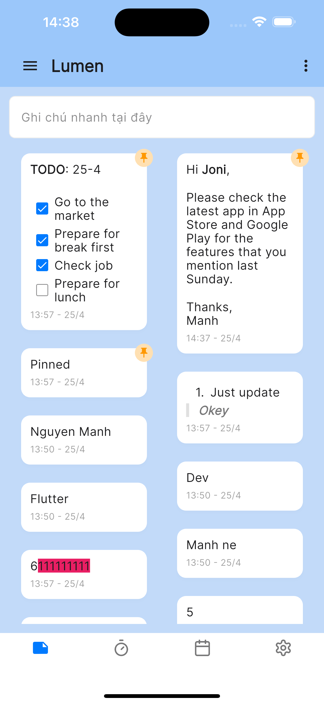
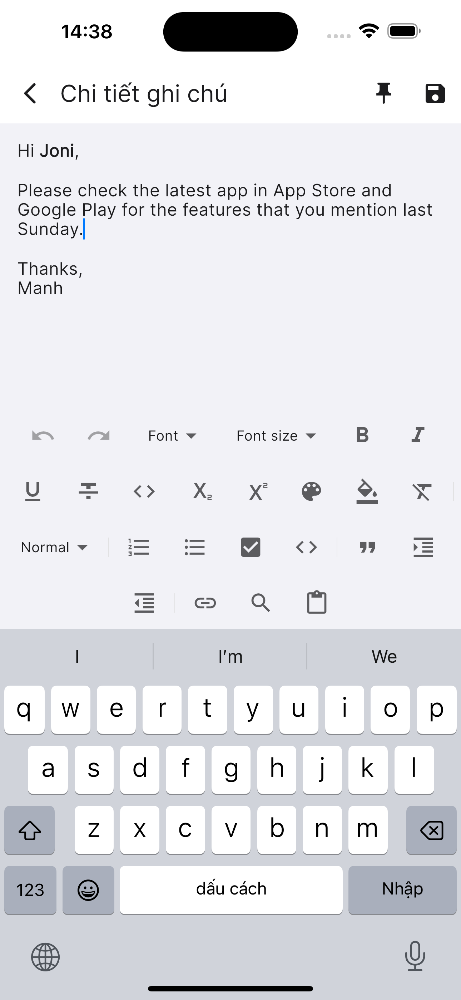
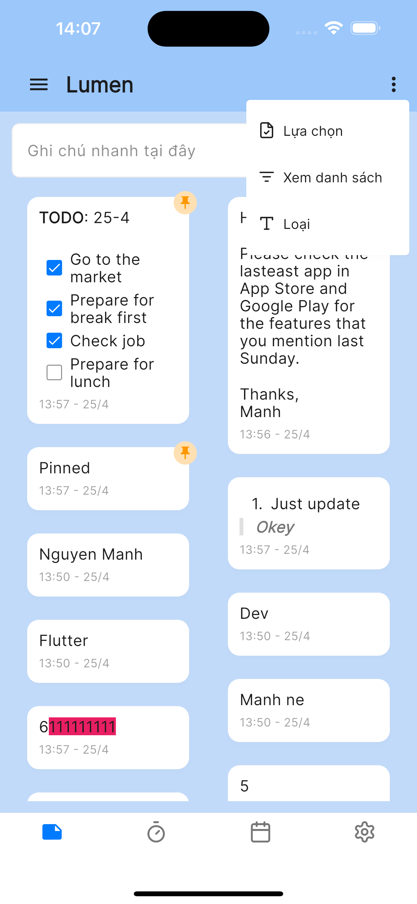
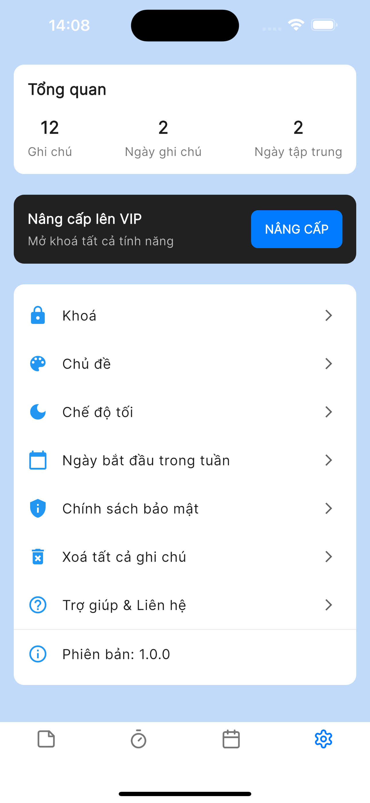

# 🌟 Lumen – Focus Timer & Notes App

**Lumen** is a Flutter-based mobile application designed to help you stay focused and productive using the Pomodoro technique and quick note-taking. Its minimalist interface is simple to use, making it ideal for anyone pursuing deep work and creative thinking.

---

## Features

- 📝 **Create and manage notes** quickly
- ⏱️ **Focus** with a flexible timer and store the history
- 💾 **Local (offline) note storage**
- ✨ **Use various themes** for personalization
- 📅 **Overview of focus timer and notes history**

---

## Packages Used

- `hive: ^2.2.3` – Local storage solution
- `hive_flutter: ^1.1.0` – Flutter integration with Hive
- `bloc: ^9.0.0` – State management using BLoC pattern
- `logger: ^2.5.0` – For logging
- `get_it: ^8.0.3` – Service locator for dependency injection
- `equatable: ^2.0.7` – To easily compare objects
- `flutter_bloc: ^9.1.0` – BLoC pattern for Flutter
- `google_fonts: ^6.2.1` – Google Fonts integration
- `go_router: ^15.1.1` – Routing library for Flutter
- `lucide_icons: ^0.257.0` – Icon library
- `flutter_quill: ^11.2.0` – Rich text editor
- `path: ^1.9.1` – File path utilities
- `flutter_staggered_grid_view: ^0.7.0` – Staggered grid layout for Flutter
- `url_launcher: ^6.3.1` – Launch URLs from your app
- `table_calendar: ^3.1.3` – Calendar widget for Flutter
- `intl: ^0.19.0` – Internationalization support

---

## Dev Dependencies

- `build_runner: ^2.4.15` – For code generation
- `hive_generator: ^2.0.1` – Code generation for Hive

---

## Folder Structure

```
lumen-lib/
│
├── bootstrap/               # Bootstrap-related files
│
├── config/                  # Configuration files
│   └── routes/              # Route definitions and related logic
│
├── core/                    # Core features and logic
│   ├── constants/           # App-wide constants
│   ├── di/                  # Dependency injection setup
│   ├── network/             # Networking logic and services
│   ├── screens/             # Screen UI components
│   ├── theme/               # Themes and styling
│   ├── utils/               # Utility functions and helpers
│   └── widgets/             # Reusable widgets
│
├── features/                # Specific feature modules
│   ├── calendar/            # View detailed focus sessions or notes for a specific date
│   ├── notes/               # Notes management functionality
│   ├── settings/            # Settings and preferences
│   └── timer/                # Countdown timer features
│
└── flavors/                 # Flavors for different environments (Dev, Staging, Production)
```

---

## 🖼️ Screenshots
Here are some screenshots of Lumen app:

|  |  |  |  |
|---|---|---|---|
|  |  |  |  |
|---|---|---|---|
|  |  |  |  |

---

## Installation

1. Clone the repository:
   ```bash
   git clone https://github.com/manh-nguyen-dev/lumen.git
   ```

2. Navigate to the project directory:
   ```bash
   cd lumen
   ```

3. Install dependencies:
   ```bash
   flutter pub get
   ```

4. To generate the necessary code for Hive:
   ```bash
   flutter packages pub run build_runner build
   ```

---

## Run the App (by Flavor)

You can run the app for different environments (Dev, Staging, and Production) by specifying the appropriate flavor.

- **Dev (Development)**:
  ```bash
  fvm flutter run -t lib/flavors/main_development.dart
  ```

- **Staging**:
  ```bash
  fvm flutter run -t lib/flavors/main_staging.dart
  ```

- **Production (Release)**:
  ```bash
  fvm flutter run -t lib/flavors/main_production.dart --release
  ```

Make sure you have `fvm` (Flutter Version Manager) set up for managing different versions of Flutter. If you don't have it yet, you can install it by following the official [FVM installation guide](https://fvm.app/documentation/getting-started/installation).

---

## Usage

- **Notes**: Quickly create and edit notes with flexible local storage.
- **Focus Timer**: Use the Pomodoro technique with adjustable timers, and track your focus history.
- **Themes**: Switch between different themes to match your preference.
- **History**: View a history of your timers and notes for better productivity tracking.

---

## Contributing

1. Fork the repository
2. Create a new branch (`git checkout -b feature-xyz`)
3. Commit your changes (`git commit -m 'Add feature xyz'`)
4. Push to the branch (`git push origin feature-xyz`)
5. Create a new Pull Request